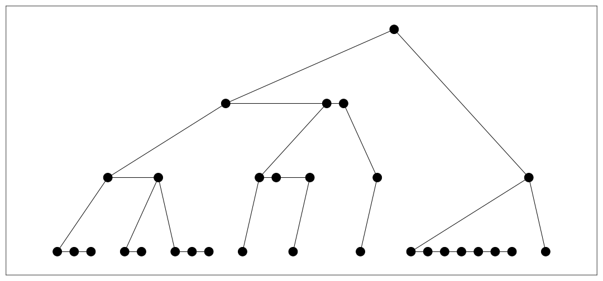

---
html:
  embed_local_images: false
  embed_svg: false
  offline: false
  toc: true

print_background: false

export_on_save:
  html: true
---

link: [test.html](test.html)

kpokop
 pokpko 
 k pok pok 
  pko 
   pok po 
   pok 

[wiki](https://www.wikipedia.org/)

[python code](https://github.com/mtomassoli/test/blob/main/asd.py)

v2
